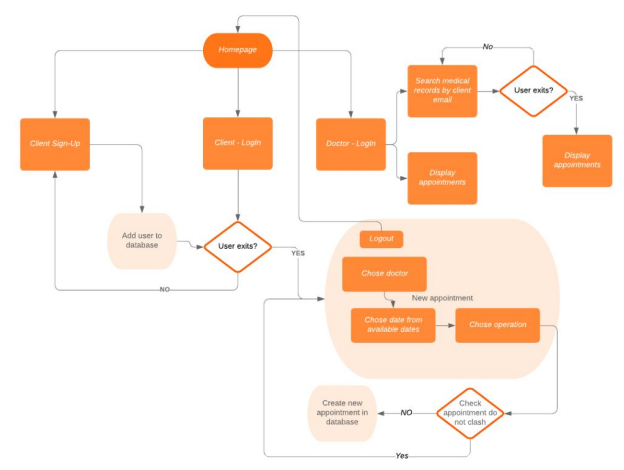
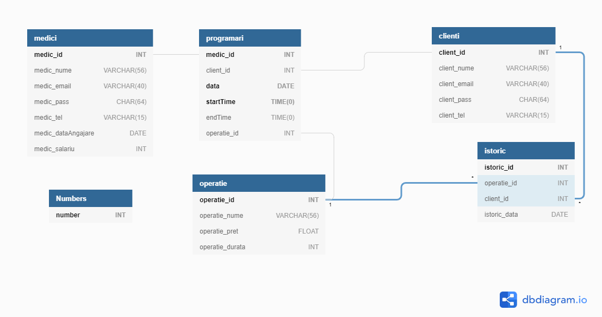
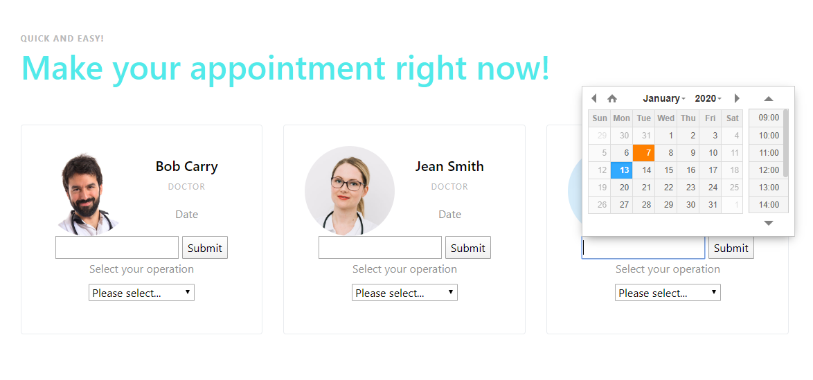
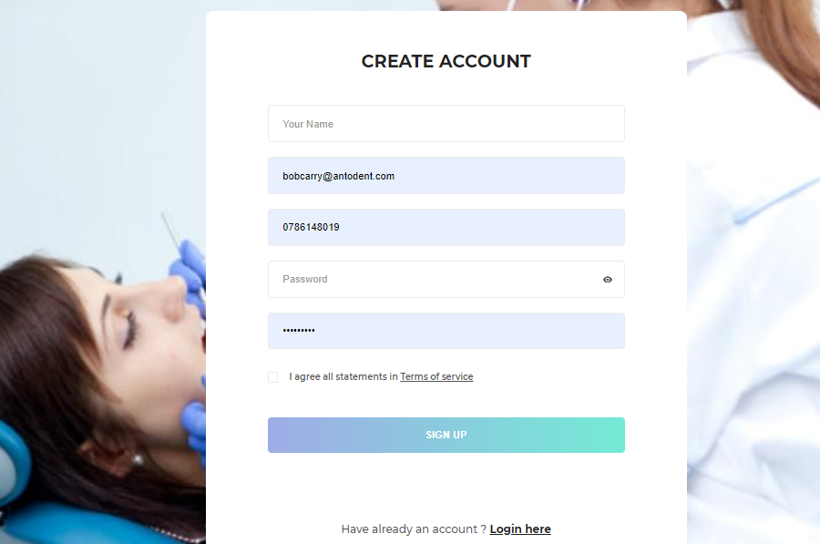

# DB Project - Web app for Dental Clinic Management
## **BE: Python, Flask**
## **FE: HTML, CSS, javascript/ jQuerry**

* DB Features:
  - autoincrement
    ```
    create table istoric(
    istoric_id      INT NOT NULL AUTO_INCREMENT,
    ```
  - constraints:
      - appointment time can be divided by 10 mins
      - no appointments before 9:00
      - no appointments after 17:00
      - appointment end time cannot be earlier than start time
  ```
  CONSTRAINT mustStartOnTenMinuteBoundary CHECK (
        EXTRACT(MINUTE FROM startTime) % 10 = 0
        AND EXTRACT(SECOND FROM startTime) = 0
    ),
    CONSTRAINT mustEndOnTenMinuteBoundary CHECK (
        EXTRACT(MINUTE FROM endTime) % 10 = 0
        AND EXTRACT(SECOND FROM endTime) = 0
    ),
    CONSTRAINT cannotStartBefore0900 CHECK (
        EXTRACT(HOUR FROM startTime) >= 9
    ),
    CONSTRAINT cannotEndAfter1700 CHECK (
        EXTRACT(HOUR FROM (startTime - INTERVAL 1 SECOND)) < 17
    ),
    CONSTRAINT mustEndAfterStart CHECK (
        endTime > startTime
    )
  ```
  - DB *function* for checks: *slotIsAvailable*
```
CREATE FUNCTION slotIsAvailable(
    medic_id            INT,
    slotStartDateTime   DATETIME,
    slotEndDateTime     DATETIME
) RETURNS BOOLEAN NOT DETERMINISTIC
BEGIN
    RETURN CASE WHEN EXISTS (
        -- This table will contain records iff the slot clashes with an existing appointment
        SELECT TRUE
        FROM programari AS p
        WHERE
                CONVERT(slotStartDateTime, TIME) < p.endTime   -- These two conditions will both hold iff the slot overlaps
            AND CONVERT(slotEndDateTime,   TIME) > p.startTime -- with the existing appointment that it's being compared to
            AND p.medic_id = medic_id
            AND p.data = CONVERT(slotStartDateTime, DATE)
    ) THEN FALSE ELSE TRUE
    END;
END;
```
  - DB *trigger* to be fired befor inseting new appointment (calls slotIsAvailable)
```
CREATE TRIGGER ensureNewAppointmentsDoNotClash
    BEFORE INSERT ON programari
    FOR EACH ROW
BEGIN
    IF NOT slotIsAvailable(
        NEW.medic_id,
        CAST( CONCAT(NEW.data, ' ', NEW.startTime)  AS DATETIME ),
        CAST( CONCAT(NEW.data, ' ', NEW.endTime)    AS DATETIME )
    ) THEN
        SIGNAL SQLSTATE '45000' SET MESSAGE_TEXT = 'Appointment clashes with an existing appointment!';
    END IF;
END;
```
  - DB *event* runs daily, checks if appointments are in the past, moves them to history table
```
CREATE EVENT removeOldAppointmetsEvent
    ON SCHEDULE
      EVERY 1 DAY
ON COMPLETION PRESERVE
    DO
      BEGIN
            INSERT INTO istoric (operatie_id, client_id, medic_id, data)
                SELECT operatie_id, client_id, medic_id, data 
                FROM programari AS p
                WHERE p.data <= DATE(NOW());
            DELETE FROM programari p WHERE p.data <= DATE(NOW());
      END
```
  - Procedure *testRemovedEvent* can be called manually to test the event above
  - DB *variables*:
    - _log_bin_trust_function_creators - avoid errors in slotIsAvailable (https://dev.mysql.com/doc/refman/8.0/en/stored-programs-logging.html)
    - event_scheduler - starts event thread in mySql daemon (mysql> show processlist;)
  - additional procedures: getAllDiscountOperations, getMedicBonus

# Run app:
* RUN:
docker-compose build --no-cache
docker-compose up
docker run mysql -P 3306

* DELETE DOCKER IMAGE:
docker-compose down
docker system prune -a

* CONNECT TO MYSQL DB:
docker run  -d --env="MYSQL_ROOT_PASSWORD=root" -p 32000:3306 mysql
mysql -P 32000 -u root -p dent

# App description
* docker-compose.yml contains 2 services: *db* and *py*



# Pages
* Landing page:


* Appointments: 


* Search medical records (logged-in as medic):


* Sign up:

